# คู่มือการใช้งาน INVE BURN RUNNING 2026

คู่มือนี้อธิบายการใช้งานระบบสำหรับ **พนักงาน** และ **ผู้ดูแลระบบ (Admin)** พร้อมภาพตัวอย่างจากหน้าเว็บจริง/หน้าจอตัวอย่างของระบบ

> เว็บไซต์ใช้งานจริง: https://inve-burn-running.vercel.app/
>
> ข้อมูลหลักเชื่อมต่อกับ Google Sheet และรูปหลักฐานการวิ่งถูกเก็บใน Google Drive ตามที่ตั้งค่าไว้ใน Google Apps Script

## สารบัญ

- [ภาพรวมระบบ](#ภาพรวมระบบ)
- [คู่มือสำหรับพนักงาน](#คู่มือสำหรับพนักงาน)
  - [1. หน้าแรกและอันดับรวม](#1-หน้าแรกและอันดับรวม)
  - [2. ลงทะเบียนเข้าร่วมกิจกรรม](#2-ลงทะเบียนเข้าร่วมกิจกรรม)
  - [3. เข้าสู่ระบบ](#3-เข้าสู่ระบบ)
  - [4. หน้าโปรไฟล์พนักงาน](#4-หน้าโปรไฟล์พนักงาน)
  - [5. เปลี่ยนรูปโปรไฟล์](#5-เปลี่ยนรูปโปรไฟล์)
  - [6. บันทึกผลการวิ่งและอัปโหลดรูป](#6-บันทึกผลการวิ่งและอัปโหลดรูป)
  - [7. คลิกดูรูปหลักฐานที่อัปโหลด](#7-คลิกดูรูปหลักฐานที่อัปโหลด)
  - [8. ออกจากระบบ](#8-ออกจากระบบ)
- [คู่มือสำหรับผู้ดูแลระบบ](#คู่มือสำหรับผู้ดูแลระบบ)
  - [1. เข้าสู่ระบบผู้ดูแล](#1-เข้าสู่ระบบผู้ดูแล)
  - [2. แดชบอร์ดผู้ดูแล](#2-แดชบอร์ดผู้ดูแล)
  - [3. จัดการพนักงาน](#3-จัดการพนักงาน)
  - [4. รายงานสรุป](#4-รายงานสรุป)
  - [5. อันดับตามกิโลเมตร](#5-อันดับตามกิโลเมตร)
  - [6. ตรวจข้อมูลใน Google Sheet และ Google Drive](#6-ตรวจข้อมูลใน-google-sheet-และ-google-drive)
- [การแก้ปัญหาเบื้องต้น](#การแก้ปัญหาเบื้องต้น)

---

## ภาพรวมระบบ

ระบบ INVE BURN RUNNING 2026 ใช้สำหรับให้พนักงานลงทะเบียนกิจกรรมวิ่งสะสมระยะทาง เลือกเป้าหมาย **10 กิโลเมตร** หรือ **20 กิโลเมตร** แล้วบันทึกผลการวิ่งพร้อมรูปหลักฐาน

ข้อมูลที่ระบบใช้งาน:

| ส่วนข้อมูล | แหล่งเก็บข้อมูล | ใช้ทำอะไร |
|---|---|---|
| รายชื่อพนักงาน | Google Sheet แท็บ `Employees` | ใช้ค้นหาข้อมูลจากรหัสพนักงานตอนสมัคร |
| ผู้ลงทะเบียน | Google Sheet แท็บ `Users` | เก็บผู้สมัคร เป้าหมาย และรหัสผ่าน |
| ผลการวิ่ง | Google Sheet แท็บ `Runs` | เก็บวันที่วิ่ง ระยะทาง หมายเหตุ และลิงก์รูป |
| รูปหลักฐานวิ่ง | Google Drive | เก็บไฟล์รูปที่พนักงานอัปโหลด |
| รูปโปรไฟล์ | Google Sheet/Browser local cache | ใช้แสดงรูปเดียวกันในหน้าโปรไฟล์ หน้าแรก และหน้าอันดับ |

---

## คู่มือสำหรับพนักงาน

### 1. หน้าแรกและอันดับรวม

เมื่อเข้าเว็บไซต์ จะเห็นหน้าแรกพร้อมข้อมูลสรุป เช่น จำนวนผู้ลงทะเบียน ระยะทางรวม ผู้วิ่งสูงสุด และอันดับแยกตามเป้าหมายกิโลเมตร

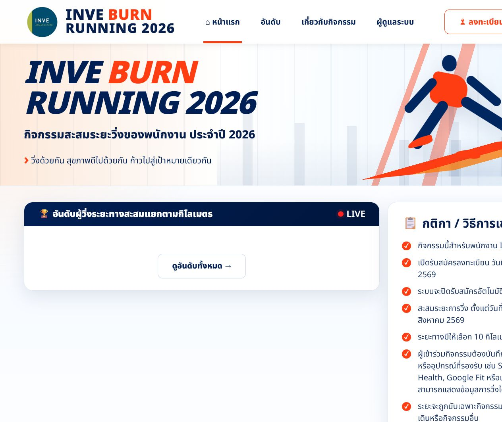

สิ่งที่ดูได้จากหน้าแรก:

1. จำนวนผู้ลงทะเบียนทั้งหมด
2. ระยะทางรวมทั้งหมด
3. ผู้วิ่งสูงสุด ณ ปัจจุบัน
4. ค่าเฉลี่ยต่อคน
5. อันดับผู้วิ่งแยกตามเป้าหมาย **10 KM** และ **20 KM**
6. กติกา/วิธีการเข้าร่วมกิจกรรม

> หน้าแรกอัปเดตข้อมูลจากระบบเป็นระยะ หากเพิ่งสมัครหรือเพิ่งบันทึกผล ให้รอสักครู่หรือรีเฟรชหน้าเว็บ

เมนู **อันดับ** ใช้ดูอันดับผู้วิ่งแยกตามเป้าหมาย **10 KM** และ **20 KM** พร้อมตัวกรองช่วงเวลา แผนก และช่องค้นหาชื่อ/รหัสพนักงาน

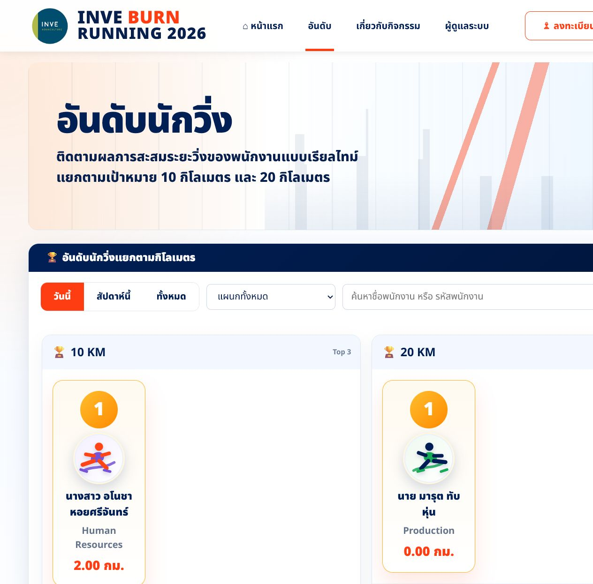

เมนู **เกี่ยวกับกิจกรรม** ใช้อ่านรายละเอียดกิจกรรม กติกา ช่วงรับสมัคร และช่วงสะสมระยะวิ่ง


---

### 2. ลงทะเบียนเข้าร่วมกิจกรรม

กดปุ่ม **ลงทะเบียน** ด้านบนของหน้าเว็บ

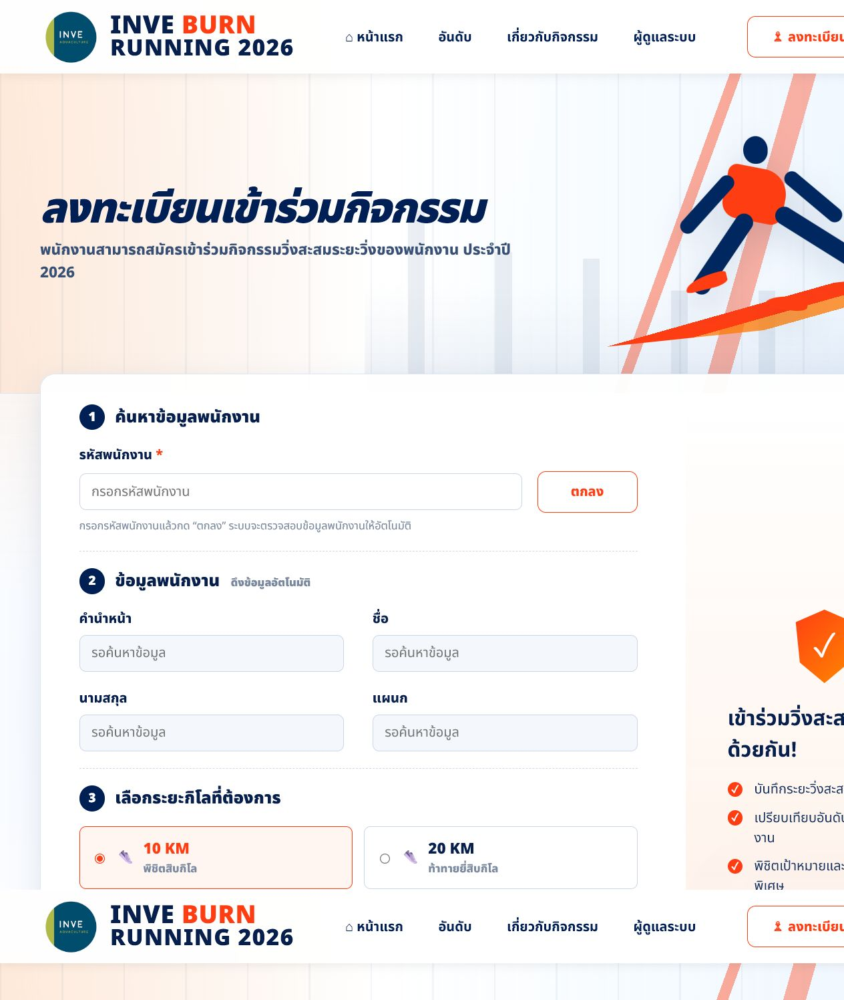

ขั้นตอนสมัคร:

1. กรอกรหัสพนักงานในช่อง **รหัสพนักงาน**
2. กดปุ่ม **ตกลง**
3. หากพบข้อมูล ระบบจะแสดงคำนำหน้า ชื่อ นามสกุล และแผนกให้อัตโนมัติ
4. เลือกระยะเป้าหมายที่ต้องการ: **10 KM** หรือ **20 KM**
5. ตั้งรหัสผ่าน และยืนยันรหัสผ่าน
6. กด **สมัครเข้าร่วม**

ข้อควรรู้:

- หากกรอกรหัสพนักงานผิด ระบบจะแจ้งว่าไม่พบข้อมูล ให้กรอกใหม่แล้วกด **ตกลง** อีกครั้ง
- หากบัญชีเคยลงทะเบียนแล้ว ระบบจะแจ้งว่า **บัญชีนี้มีอยู่แล้ว** และให้ไปเข้าสู่ระบบแทน
- ระบบรับไฟล์/ข้อมูลจาก Google Sheet จริง ดังนั้นรหัสพนักงานต้องตรงกับแท็บ `Employees`
- ช่วงรับสมัครที่แสดงบนหน้าเว็บคือ **วันที่ 13 - 31 กรกฎาคม 2569**
- หากระบบพ้นช่วงรับสมัคร จะมีข้อความแจ้งว่าปิดรับสมัครลงทะเบียน

---

### 3. เข้าสู่ระบบ

กดปุ่ม **เข้าสู่ระบบ** ด้านบนของหน้าเว็บ

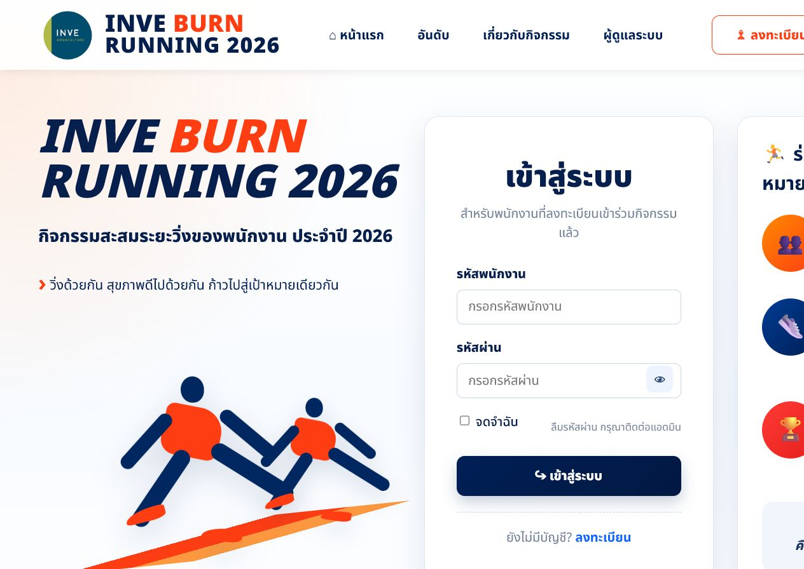

ขั้นตอนเข้าสู่ระบบ:

1. กรอกรหัสพนักงาน
2. กรอกรหัสผ่านที่ตั้งไว้ตอนสมัคร
3. กดไอคอนรูปตา หากต้องการดูรหัสผ่านที่พิมพ์
4. กด **เข้าสู่ระบบ**
5. รอจนระบบแจ้งว่าเข้าสู่ระบบสำเร็จ และพาไปหน้าโปรไฟล์พนักงาน

หากเข้าสู่ระบบไม่ได้:

- ตรวจสอบว่าลงทะเบียนแล้วหรือยัง
- ตรวจสอบรหัสผ่านให้ถูกต้อง
- หากลืมรหัสผ่าน ให้ติดต่อแอดมิน
- หากใช้ Wi‑Fi แล้วเข้าไม่ได้ แต่ใช้เน็ตมือถือเข้าได้ ให้ดูหัวข้อ [การแก้ปัญหา Wi‑Fi](#กรณีใช้-wi-fi-แล้วเข้าไม่ได้)

---

### 4. หน้าโปรไฟล์พนักงาน

หลังเข้าสู่ระบบ ระบบจะแสดงแดชบอร์ดส่วนตัวของพนักงาน


ข้อมูลที่แสดง:

1. ระยะทางสะสมทั้งหมด
2. เป้าหมายที่เลือก เช่น **10 กิโลเมตร**
3. อันดับปัจจุบันเทียบกับผู้ลงทะเบียนทั้งหมด
4. จำนวนครั้งที่บันทึกผลวิ่ง
5. กล่อง **โปรไฟล์ของฉัน** แสดงชื่อ รหัสพนักงาน แผนก และเป้าหมาย
6. ความคืบหน้าเป้าหมายเป็นเปอร์เซ็นต์
7. ฟอร์มบันทึกผลการวิ่ง
8. ประวัติการบันทึกผลการวิ่ง

---

### 5. เปลี่ยนรูปโปรไฟล์

รูปโปรไฟล์จะใช้ภาพเดียวกันในหลายจุด เช่น แถบด้านบน หน้าโปรไฟล์ หน้าแรก และหน้าอันดับ

วิธีเปลี่ยนรูป:

1. เข้าสู่ระบบ
2. ไปที่กล่อง **โปรไฟล์ของฉัน**
3. กดปุ่ม **เปลี่ยนรูปโปรไฟล์** หรือคลิกที่รูปวงกลม
4. เลือกรูปภาพจากเครื่อง
5. ระบบจะบันทึกและอัปเดตรูปให้ทันที

ข้อจำกัดรูปโปรไฟล์:

- รองรับไฟล์ JPG, JPEG, PNG
- ขนาดไฟล์ไม่เกิน 5MB
- หากไม่ได้ใส่รูป ระบบจะแสดงรูปนักวิ่งการ์ตูนแทน
- รูปโปรไฟล์ถูกย่อและบันทึกเป็น Base64 เพื่อให้แสดงในหน้าเว็บได้รวดเร็ว

---

### 6. บันทึกผลการวิ่งและอัปโหลดรูป

ในหน้าโปรไฟล์พนักงาน ให้ดูที่กล่อง **บันทึกผลการวิ่ง**

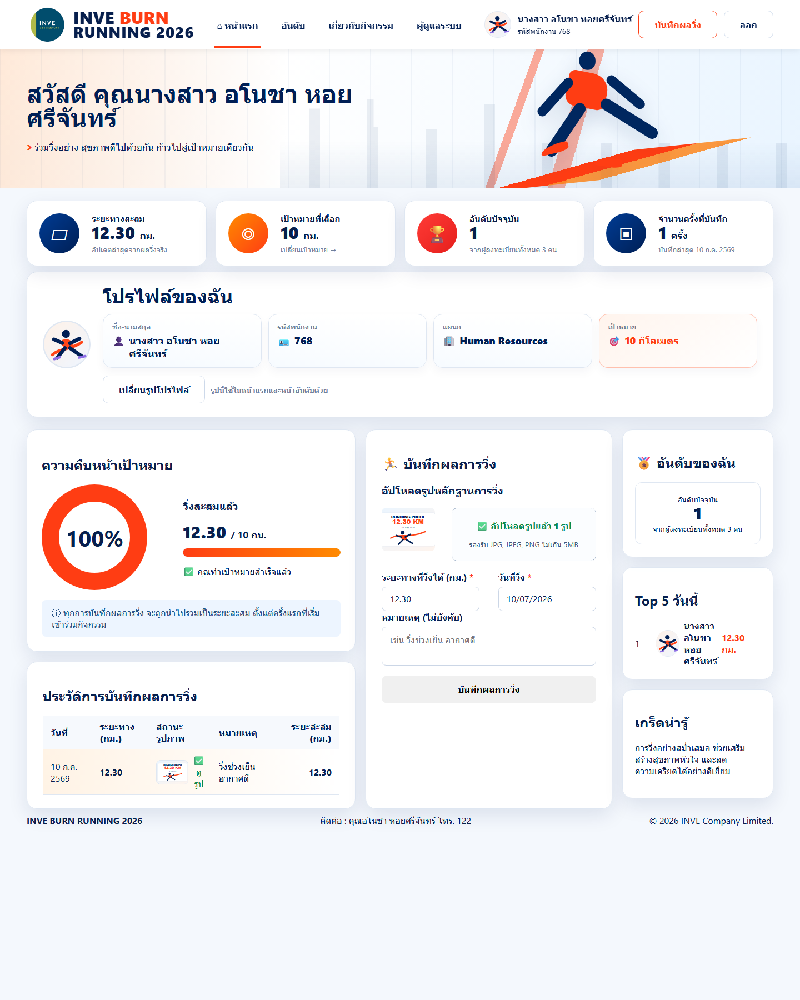

ขั้นตอนบันทึกผล:

1. กดบริเวณกล่องอัปโหลดรูป หรือคลิกเลือกไฟล์
2. เลือกรูปหลักฐานการวิ่ง **ได้ครั้งละ 1 รูปเท่านั้น**
3. กรอกระยะทางที่วิ่งได้ เช่น `2.50` หรือ `12.30`
4. เลือกวันที่วิ่ง
5. กรอกหมายเหตุ ถ้าต้องการ เช่น `วิ่งช่วงเย็น อากาศดี`
6. กด **บันทึกผลการวิ่ง**
7. รอจนระบบแจ้งว่าบันทึกสำเร็จ

ข้อจำกัดรูปหลักฐาน:

- อัปโหลดได้ครั้งละ **1 รูป**
- รองรับ JPG, JPEG, PNG
- ขนาดไฟล์ไม่เกิน 5MB
- รูปจะถูกอัปโหลดไป Google Drive
- ข้อมูลผลวิ่งจะถูกบันทึกใน Google Sheet แท็บ `Runs`
- ระยะทางทุกครั้งจะถูกนำไปรวมเป็นระยะสะสมของพนักงาน

---

### 7. คลิกดูรูปหลักฐานที่อัปโหลด

เมื่อบันทึกผลสำเร็จแล้ว ประวัติการวิ่งจะแสดงรายการพร้อมปุ่ม **ดูรูป**

วิธีดูรูป:

1. ไปที่ตาราง **ประวัติการบันทึกผลการวิ่ง**
2. กดปุ่ม **ดูรูป** ในคอลัมน์สถานะรูปภาพ
3. ระบบจะแสดงรูปเป็น popup บนหน้าเว็บทันที โดยไม่ต้องเปิด Google Drive
4. กดปุ่ม `×` หรือคลิกพื้นที่ด้านนอก popup เพื่อปิดรูป

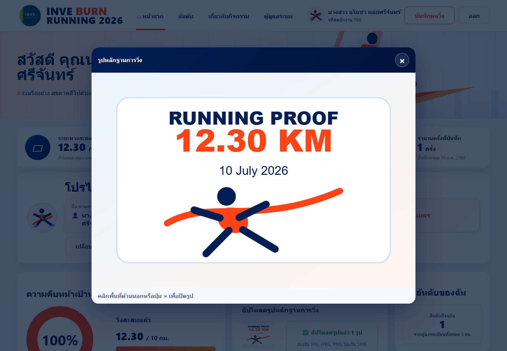

> ถ้ารูปไม่ขึ้น ให้ตรวจสอบสิทธิ์ Google Drive/Apps Script หรือเปิดลิงก์รูปจาก Google Sheet แท็บ `Runs` เพื่อตรวจไฟล์ต้นทาง

---

### 8. ออกจากระบบ

เมื่อต้องการออกจากระบบ:

1. กดปุ่ม **ออก** ด้านบนขวา
2. ระบบจะกลับไปหน้าแรก
3. หากต้องการบันทึกผลครั้งถัดไป ต้องเข้าสู่ระบบใหม่

---

## คู่มือสำหรับผู้ดูแลระบบ

### 1. เข้าสู่ระบบผู้ดูแล

กดเมนู **ผู้ดูแลระบบ** ด้านบนของหน้าเว็บ

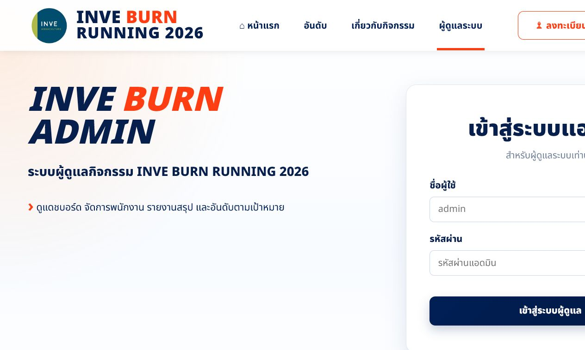

ขั้นตอน:

1. กรอกชื่อผู้ใช้ผู้ดูแล
2. กรอกรหัสผ่านผู้ดูแล
3. กด **เข้าสู่ระบบผู้ดูแล**

> ค่าเริ่มต้นในโค้ดปัจจุบันคือ `admin` / `admin2026` ควรเปลี่ยนก่อนใช้งานจริงหากต้องการความปลอดภัยมากขึ้น

---

### 2. แดชบอร์ดผู้ดูแล

หลังเข้าสู่ระบบผู้ดูแล สามารถดูภาพรวมกิจกรรมได้จากเมนู **แดชบอร์ด**

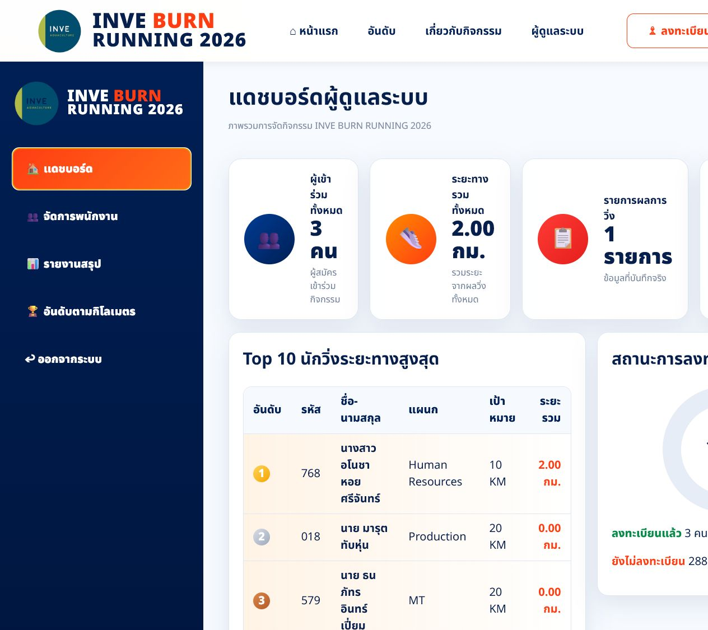

ข้อมูลที่ดูได้:

1. จำนวนผู้เข้าร่วมทั้งหมด
2. ระยะทางรวมทั้งหมด
3. รายการผลวิ่งที่มีในระบบ
4. ผู้วิ่งยอดเยี่ยมตามอันดับ
5. สรุปสถานะผู้สมัครและเป้าหมาย

---

### 3. จัดการพนักงาน

เมนู **จัดการพนักงาน** ใช้ดูรายชื่อพนักงานทั้งหมดจากแท็บ `Employees` และสถานะว่าลงทะเบียนแล้วหรือยัง

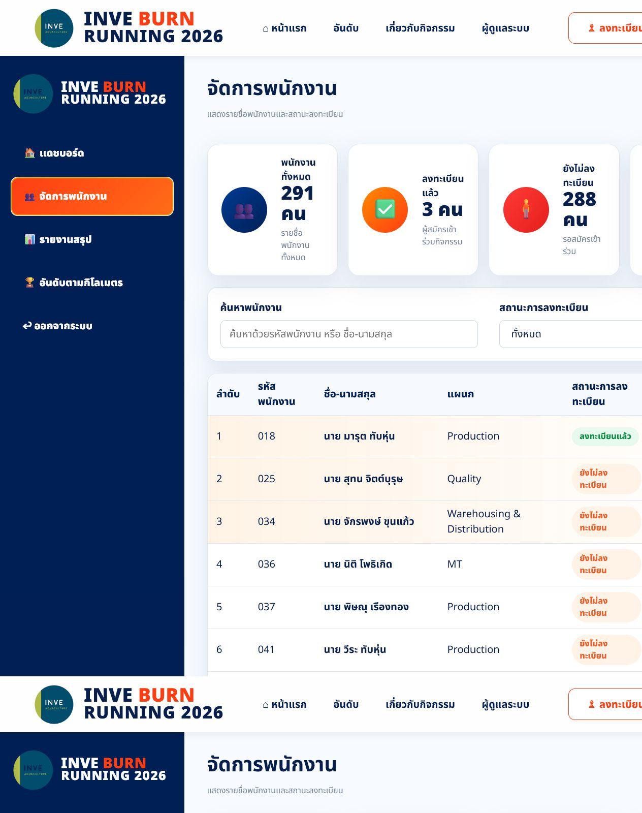

สิ่งที่ทำได้:

1. ค้นหาด้วยรหัสพนักงาน หรือชื่อ-นามสกุล
2. กรองสถานะ: ทั้งหมด / ลงทะเบียนแล้ว / ยังไม่ลงทะเบียน
3. ดูแผนกของพนักงาน
4. ดูเป้าหมายที่เลือก
5. ดูระยะสะสมของแต่ละคน

> ระบบไม่แสดงช่องเบอร์โทรศัพท์ เพราะ Google Sheet ของระบบไม่มีคอลัมน์เบอร์โทรศัพท์

---

### 4. รายงานสรุป

เมนู **รายงานสรุป** ใช้ดูภาพรวมแบบแยกกลุ่ม

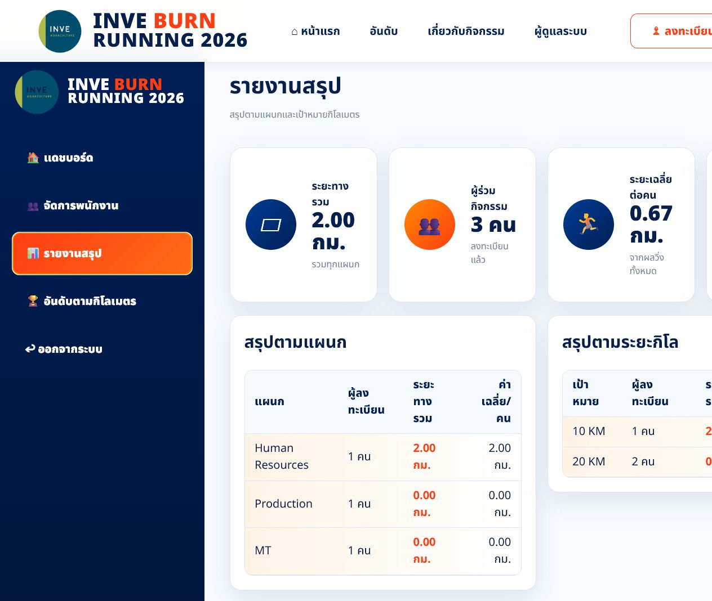

รายงานที่ดูได้:

1. สรุปจำนวนผู้สมัครทั้งหมด
2. สรุปตามแผนก
3. สรุปตามเป้าหมายกิโลเมตร เช่น 10 KM และ 20 KM
4. ระยะทางรวมและค่าเฉลี่ย

---

### 5. อันดับตามกิโลเมตร

เมนู **อันดับตามกิโลเมตร** ใช้ดูอันดับผู้วิ่งแยกตามเป้าหมายที่เลือก

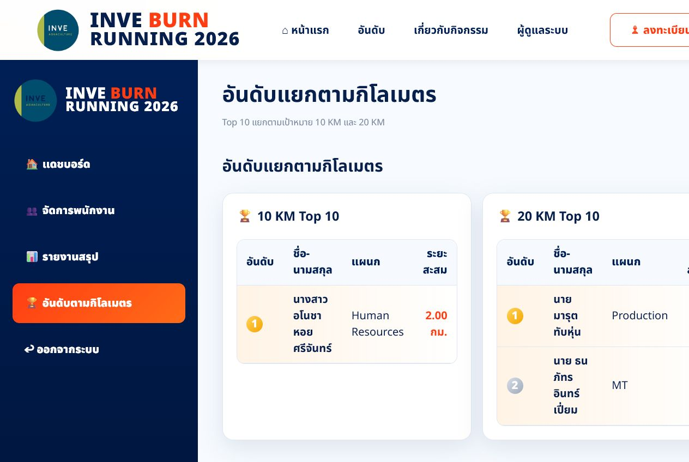

วิธีใช้งาน:

1. เลือกช่วงเวลา เช่น วันนี้ / สัปดาห์นี้ / ทั้งหมด
2. เลือกแผนก ถ้าต้องการกรองเฉพาะแผนก
3. ค้นหาด้วยชื่อหรือรหัสพนักงาน
4. ดูอันดับแยกเป็นกล่อง **10 KM** และ **20 KM**

> หน้านี้เหมาะสำหรับแสดงผลให้ผู้บริหารหรือทีมงานดูอันดับแบบรวดเร็ว

---

### 6. ตรวจข้อมูลใน Google Sheet และ Google Drive

ผู้ดูแลสามารถตรวจข้อมูลหลังบ้านได้จาก Google Sheet และ Google Drive ที่เชื่อมไว้

#### Google Sheet

แท็บหลักที่ใช้งาน:

- `Employees` — รายชื่อพนักงานต้นทาง ใช้ค้นหาข้อมูลตอนสมัคร
- `Users` — รายชื่อผู้ที่ลงทะเบียนแล้ว เป้าหมายที่เลือก และข้อมูลเข้าสู่ระบบ
- `Runs` — ผลการวิ่งแต่ละครั้ง ระยะทาง วันที่ หมายเหตุ และลิงก์รูปหลักฐาน

วิธีตรวจผลการวิ่ง:

1. เปิด Google Sheet
2. ไปที่แท็บ `Runs`
3. ดูรหัสพนักงาน วันที่วิ่ง ระยะทาง และคอลัมน์รูปภาพ/ลิงก์รูป
4. คลิกลิงก์รูปเพื่อเปิดดูใน Google Drive ได้

#### Google Drive

รูปหลักฐานการวิ่งจะถูกอัปโหลดเข้าโฟลเดอร์ Google Drive ที่ตั้งไว้ใน Apps Script

ชื่อไฟล์ที่ระบบตั้งไว้ควรมีข้อมูลประมาณนี้:

```text
ครั้งที่_รหัสพนักงาน_ชื่อ_วันที่
```

ตัวอย่าง:

```text
1_768_นางสาว อโนชา หอยศรีจันทร์_2026-07-10.jpg
```

---

## การแก้ปัญหาเบื้องต้น

### กรณีใช้ Wi‑Fi แล้วเข้าไม่ได้

ถ้าใช้เน็ตมือถือเข้าได้ แต่ใช้ Wi‑Fi เข้าไม่ได้ อาจเกิดจากเครือข่ายหน่วงหรือบล็อกการเรียกใช้งาน Vercel / Google Apps Script

ให้ IT หรือผู้ดูแลเครือข่าย whitelist โดเมนเหล่านี้:

```text
inve-burn-running.vercel.app
script.google.com
docs.google.com
drive.google.com
```

### กดเข้าสู่ระบบแล้วเหมือนนิ่ง

ระบบจะแสดงข้อความกำลังเข้าสู่ระบบ หากเครือข่ายช้าจะรอประมาณ 15 วินาทีแล้วแจ้งเตือน

วิธีแก้:

1. ตรวจ Wi‑Fi หรือสลับเป็น 4G/5G
2. รีเฟรชหน้าเว็บ
3. ลองเข้าสู่ระบบใหม่
4. หากยังไม่ได้ ให้ตรวจ Apps Script URL และสิทธิ์ Deploy

### กดตกลงค้นหารหัสพนักงานไม่เจอ

ตรวจสอบดังนี้:

1. รหัสพนักงานมีอยู่ในแท็บ `Employees` หรือไม่
2. รหัสที่ขึ้นต้นด้วย 0 เช่น `018` ให้ใส่เลข 0 ให้ครบ
3. Google Sheet ต้องเปิดให้ Apps Script อ่านได้
4. Apps Script ต้อง Deploy เป็น Web App เวอร์ชันล่าสุด

### สมัครแล้วไม่ขึ้นในหน้าแรก

ตรวจสอบดังนี้:

1. ดูว่าแถวถูกเพิ่มในแท็บ `Users` หรือไม่
2. รีเฟรชหน้าเว็บหน้าแรก
3. รอระบบอัปเดต realtime สักครู่
4. ตรวจว่า Apps Script URL ใน `index.html` และ `api/apps-script.js` เป็น URL ล่าสุด

### อัปโหลดรูปแล้วไม่สำเร็จ

ตรวจสอบดังนี้:

1. รูปต้องเป็น JPG, JPEG หรือ PNG
2. ขนาดไม่เกิน 5MB
3. อัปโหลดได้ครั้งละ 1 รูป
4. Google Apps Script ต้องได้รับสิทธิ์ Google Drive
5. Apps Script ต้องตั้งค่า `DRIVE_FOLDER_ID` ถูกต้อง
6. ถ้าเคยเจอข้อความ `DriveApp` ให้เปิด Apps Script แล้ว Run ฟังก์ชันสำหรับ authorize สิทธิ์ จากนั้น Deploy ใหม่

### คลิกดูรูปแล้วรูปไม่ขึ้น

ตรวจสอบดังนี้:

1. ในแท็บ `Runs` มีลิงก์รูปหรือไม่
2. ลิงก์รูปยังเปิดได้ใน Google Drive หรือไม่
3. ไฟล์ใน Drive ไม่ถูกลบหรือย้าย
4. หากเป็นรูปจาก Drive ระบบจะแสดงผ่าน thumbnail popup บนหน้าเว็บ

### ข้อมูลหน้าเว็บกับ Google Sheet ไม่ตรงกัน

ให้ทำตามลำดับ:

1. รีเฟรชหน้าเว็บ
2. ตรวจแท็บ `Users` และ `Runs`
3. ตรวจ Apps Script URL ล่าสุด
4. ตรวจว่า Vercel deploy ใช้ commit ล่าสุด
5. หากเปลี่ยนโค้ด Apps Script ต้องกด Deploy เวอร์ชันใหม่ทุกครั้ง

---

## หมายเหตุสำหรับผู้ดูแลระบบ

- ควรสำรอง Google Sheet ก่อนวันใช้งานจริง
- ควรทดสอบสมัคร, เข้าสู่ระบบ, อัปโหลดรูป, และคลิกดูรูปอย่างน้อย 1 รอบก่อนเริ่มกิจกรรม
- หากเปลี่ยน Apps Script URL ให้แก้ทั้ง `index.html` และ `api/apps-script.js`
- หากมีปัญหาหน้าเว็บ production ไม่อัปเดต ให้ตรวจ GitHub commit และ Vercel deployment ล่าสุด

---

อัปเดตล่าสุด: 10 กรกฎาคม 2026
